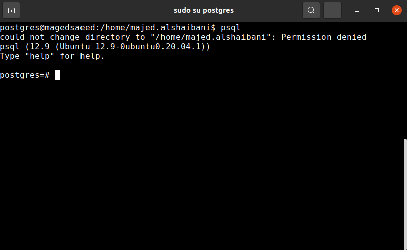

# Postgresql database

## Ubuntu

### Install

- `apt-get install postgresql postgresql-contrib`
- configuration path `/etc/postgresql/{ver.sion}/main/postgresql.conf`
- check if the database is running: `systemctl status postgresql` or `service postgresql status`.

### interact

The next instructions uses `psql` command-line tool to interact with postgres database.

The default user for postgres is `postgres`. To interact with the server, first change user to postgres user `sudo su postgres`.

Press psql in the terminal to start `psql` tool.



commands:

- List databases: `\l`
- List users: `\du`
- Change user password of the default user: `ALTER USER postgres PASSWORD {PUT-THE-PASSWORD};`
- Create new user: `CREATE USER {username} WITH PASSWORD '{PUT-THE-PASSWORD}';`.
- List the users again: `\l`
- Remove user: `DROP USER username;`.
- Create Database: `CREATE DATABASE {database_name};`. This command can be more sophisticated with all the columns and data required. However, if the purpose is only to create the database and populate it by a migration from a framework like Django, this command serves the need.
- Drop Database: `DROP DATABASE [IF EXISTS] {database_name};`
- Change database owner: `'ALTER DATABASE name OWNER TO new_owner;'`
- To connect to a database: `\c database`
- To grant a user an access to the databse:
 ```bash
 psql mydatabase -c "GRANT ALL ON ALL TABLES IN SCHEMA public to dbuser;"
 psql mydatabase -c "GRANT ALL ON ALL SEQUENCES IN SCHEMA public to dbuser;"
 psql mydatabase -c "GRANT ALL ON ALL FUNCTIONS IN SCHEMA public to dbuser;"
 ```

### resources:
- https://www.youtube.com/watch?v=-LwI4HMR_Eg&t=382s&ab_channel=ProgrammingKnowledge

# SQLite support for JSONField
## More
- https://code.djangoproject.com/wiki/JSON1Extension
- https://stackoverflow.com/questions/4313323/how-to-change-owner-of-postgresql-database
- https://stackoverflow.com/a/39070745/4412324
